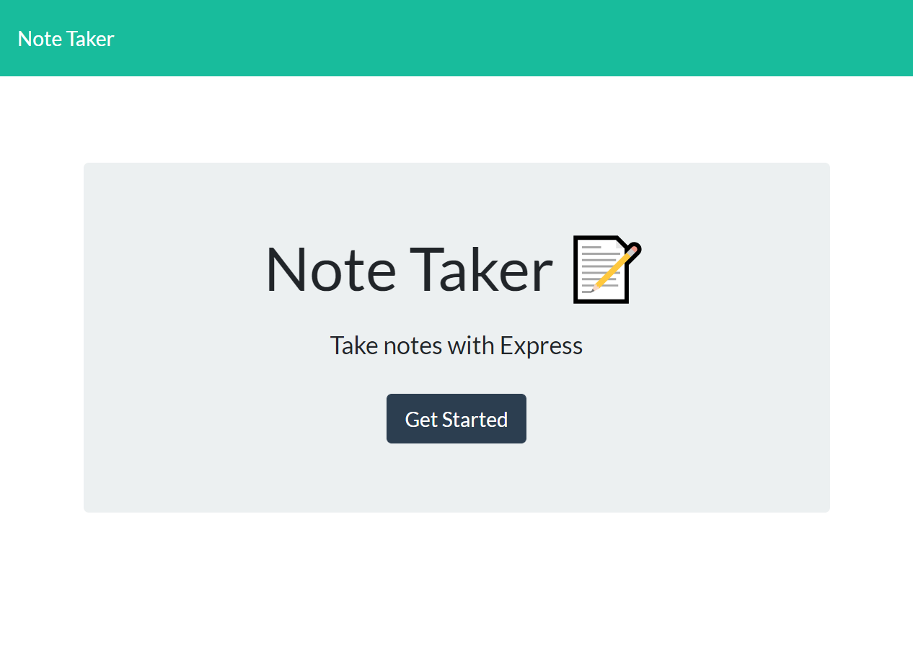
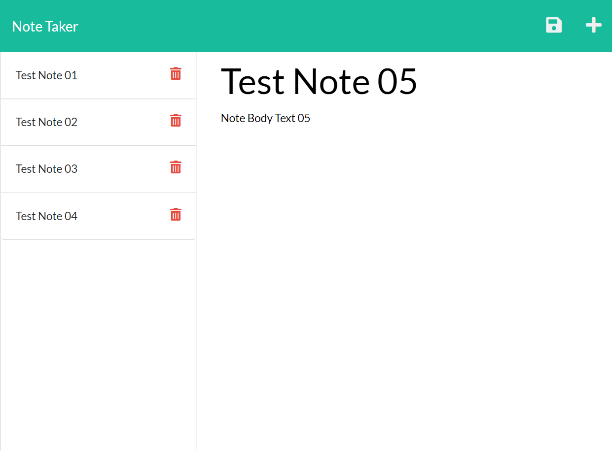

# Vik's Note Taker App

## Description

As a small business owner, it is often important to organize thoughts and keep track of vital tasks that need to be completed. A key step in doing so is being able to easily, and conveniently, write and save notes, and then keep them somewhere that can be readily retrieved.

Enter the purpose of this project: utilize the power of Node.js and Express.js to create a note-taking application. The application runs entirely in the browser, can be viewed anywhere online, and includes the following features:

- Once the application starts, the user is presented with a landing page with a link to the notes page.
- At the notes page, the user has the opportunity create a new note by entering the note's title and text.
- Upon entering the information for a new note, a SAVE icon appears in the navigation at the top of the page and the user is able to save the note.
- After saving the note, it is then displayed in the left-hand column with any other existing notes.
- The user can click on any of the existing notes in the left-hand column to view the title and text for that particular note.
- The user has the option to click on the trashcan icon next to any existing note, and delete that particular note from the list.

Link to the deployed website: https://vik-note-taker.herokuapp.com


## Installation

To install this application, first clone the repo to your local machine. Then, install the node dependencies/modules which can be done by running the ```npm install``` command in your terminal/bash shell. Once this has been completed, you are ready to use the application, and can start the program with either the command ```node server.js``` or ```npm run start```.


## Usage

Using any desktop browser, click the above-mentioned link to open and use the application.






## Credits

Collaborators include the instructor, TAs, and fellow classmates of the UCF Coding Bootcamp (Spring 2022).


## License

Copyright (c) 2022 Vik Maharaj

Permission is hereby granted, free of charge, to any person obtaining a copy of this software and associated documentation files (the "Software"), to deal
in the Software without restriction, including without limitation the rights to use, copy, modify, merge, publish, distribute, sublicense, and/or sell copies of the Software, and to permit persons to whom the Software is furnished to do so, subject to the following conditions:

The above copyright notice and this permission notice shall be included in all copies or substantial portions of the Software.

THE SOFTWARE IS PROVIDED "AS IS", WITHOUT WARRANTY OF ANY KIND, EXPRESS OR IMPLIED, INCLUDING BUT NOT LIMITED TO THE WARRANTIES OF MERCHANTABILITY,
FITNESS FOR A PARTICULAR PURPOSE AND NONINFRINGEMENT. IN NO EVENT SHALL THE AUTHORS OR COPYRIGHT HOLDERS BE LIABLE FOR ANY CLAIM, DAMAGES OR OTHER LIABILITY, WHETHER IN AN ACTION OF CONTRACT, TORT OR OTHERWISE, ARISING FROM, OUT OF OR IN CONNECTION WITH THE SOFTWARE OR THE USE OR OTHER DEALINGS IN THE SOFTWARE.


## Badges


[](https://opensource.org/licenses/MIT)